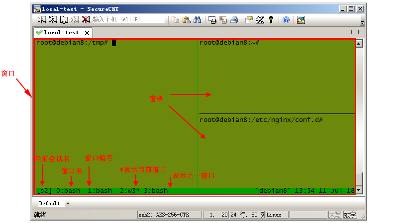

1.install
如果是ubuntu，直接用apt-get安装，我用的是centos做测试，所以用源码安装
wget https://github.com/downloads/libevent/libevent/libevent-2.0.20-stable.tar.gz --no-check-certificate
tar xvzf libevent-2.0.20-stable.tar.gz
cd libevent-2.0.20-stable/
./configure --prefix=/usr/local/libevent
make && make install

wget -c https://github.com/tmux/tmux/releases/download/3.0a/tmux-3.0a.tar.gz --no-check-certificate
tar -xvf tmux-3.0a.tar.gz
cd tmux-3.0a/
CFLAGS="-I/usr/local/libevent/include" LDFLAGS="-L/usr/local/libevent/lib" ./configure --prefix=/usr/local/tmux
make && make install

接着配置source，这样可以快捷访问
export PATH=/usr/local/tmux/bin:$PATH
source ~/.bashrc

2.tmux命令的一些应用
tmux new　　创建默认名称的会话
tmux new -s mysession　　创建名为mysession的会话
tmux ls　　显示会话列表
tmux a　　连接上一个会话
tmux a -t mysession　　连接指定会话
tmux rename -t s1 s2　　重命名会话s1为s2
tmux kill-session　　关闭上次打开的会话
tmux kill-session -t s1　　关闭会话s1
tmux kill-session -a -t s1　　关闭除s1外的所有会话
tmux kill-server　　关闭所有会话
tmux list-key　　列出所有绑定的键，等同于prefix ?
tmux list-command　　列出所有命令

Ctrl+b "　　水平分割当前窗格
Ctrl+b %　　垂直分割当前窗格
Ctrl+b x　　删除当前窗格
Ctrl+b 方向键　　通过上下左右方向键跳转到对应的pane
Ctrl+b ;　　跳转到上次激活的pane
Ctrl+b o　　跳转到下一个pane
Ctrl+b q　　显示各pane的编号，并输入编号跳转到对应的pane
Ctrl+b {　　将当前pane移动到最左边
Ctrl+b }　　将当前pane移动到最右边
Ctrl+b !　　将当前pane转变成window

